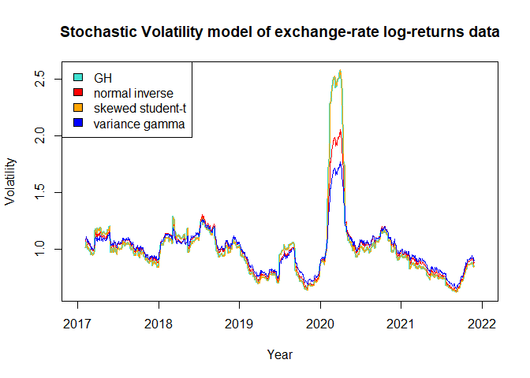

Stochastic Volatility Modeling
================
Sewon Chang
2024-08-28

``` r
library(quantmod)
library(ghyp)
```

Start with extracting the daily exchange-rate series for the currencies
EUR, RUB, and CNY from Yahoo from 2017 to 2022 using the getSymbols
function from quantmod

``` r
getSymbols("EUR=X",src="yahoo",from="2017-01-01", to="2022-01-01")
```

    ## [1] "EUR=X"

``` r
EUR <- `EUR=X`
getSymbols("RUB=X",src="yahoo",from="2017-01-01", to="2022-01-01")
```

    ## [1] "RUB=X"

``` r
RUB <- `RUB=X`
getSymbols("CNY=X",src="yahoo",from="2017-01-01", to="2022-01-01")
```

    ## [1] "CNY=X"

``` r
CNY <- `CNY=X`
```

We compute daily log returns using adjusted price of the exchange rates,
and omit any empty returns

``` r
all_returns <- cbind(diff(log(EUR$`EUR=X.Adjusted`)), diff(log(RUB$`RUB=X.Adjusted`)), ... = diff(log(CNY$`CNY=X.Adjusted`)))
all_Returns <- na.omit(all_returns)

EUR_Returns <- all_Returns$EUR.X.Adjusted
RUB_Returns <- all_Returns$RUB.X.Adjusted
CNY_Returns <- all_Returns$CNY.X.Adjusted
```

Set the five-year period to be from Jan 1st, 2017 to Dec 31st, 2021. The
training set is then from Jan 1st, 2017 to Dec 30th, 2020 and the test
set is from Jan 1st, 2020 to Dec 31st, 2021.

``` r
start_Tr <- as.Date("2017-01-01")
end_Tr <- as.Date("2020-12-31")

returnsDF <- data.frame(EUR_Returns, CNY_Returns, RUB_Returns)
returnsDF$Date <- as.Date(rownames(returnsDF))

Training <- subset(returnsDF, Date >= start_Tr, Date <= end_Tr)
Training <- subset(Training, select = -c(Date))
head(Training)
```

    ##            EUR.X.Adjusted CNY.X.Adjusted RUB.X.Adjusted
    ## 2017-01-03    0.006379979   0.0000287727  -4.903114e-05
    ## 2017-01-04    0.003841893   0.0022727609  -4.998694e-03
    ## 2017-01-05   -0.007740600  -0.0049982341  -9.201283e-03
    ## 2017-01-06   -0.009951687  -0.0053862397  -1.609508e-02
    ## 2017-01-09    0.007007119   0.0042882045   2.753713e-03
    ## 2017-01-10   -0.005375134   0.0027717025   8.983323e-03

``` r
start_test <- as.Date("2021-01-01")
end_test <- as.Date("2021-12-31")

Test <- subset(returnsDF, Date >= start_test, Date <= end_test)
Test <- subset(Test, select = -c(Date))
```

Apply generalized hyperbolic distribution, normal inverse Gaussian,
skewed student-t, and variance gamma distribution, respectively on the
multivariate data sets using fitting functions from ghyp package

Then, the sum of the densities are calculated

``` r
Training <- sapply(Training, as.numeric)
Test <- sapply(Test, as.numeric)
```

``` r
GH_Tr <- fit.ghypmv(Training)
NIG_Tr <- fit.NIGmv(Training)
t_Tr <- fit.tmv(Training)
VG_Tr <- fit.VGmv(Training)

GH_Test <- fit.ghypmv(Test)
NIG_Test <- fit.NIGmv(Test)
t_Test <- fit.tmv(Test)
VG_Test <- fit.VGmv(Test)

GH_Test_LL <- sum(dghyp(Test, GH_Tr, logvalue = TRUE))
NIG_Test_LL <- sum(dghyp(Test, NIG_Tr, logvalue = TRUE))
t_Test_LL <- sum(dghyp(Test, t_Tr, logvalue = TRUE))
VG_Test_LL <- sum(dghyp(Test, VG_Tr, logvalue = TRUE))
```

Log-likelihood of Training and Test Sets are shown in the table below:

``` r
a <- logLik(GH_Tr)
b <- logLik(NIG_Tr)
c <- logLik(t_Tr)
d <- logLik(VG_Tr)

e <- GH_Test_LL
f <- NIG_Test_LL
g <- t_Test_LL
h <- VG_Test_LL

Table <- matrix(c(a,b,c,d,e,f,g,h), ncol=2)
colnames(Table) <- c("Training", "Test")
rownames(Table) <- c("ghyp", "NIG", "t", "VG")

Table
```

    ##      Training     Test
    ## ghyp 15944.78 3362.557
    ## NIG  15940.16 3363.636
    ## t    15944.78 3362.551
    ## VG   15928.64 3362.024

Volatilies of each GH distribution from the diagonals of the covariance
matrix

``` r
GH_vol <- sqrt(diag(GH_Tr@sigma))
NIG_vol <- sqrt(diag(NIG_Tr@sigma))
t_vol <- sqrt(diag(t_Tr@sigma))
VG_vol <- sqrt(diag(VG_Tr@sigma))

vols <- data.frame(GH_vol, NIG_vol, t_vol, VG_vol)
vols
```

    ##                     GH_vol     NIG_vol       t_vol      VG_vol
    ## EUR.X.Adjusted 0.004396187 0.004338957 0.004400670 0.004264960
    ## CNY.X.Adjusted 0.002632539 0.002596983 0.002635259 0.002574845
    ## RUB.X.Adjusted 0.007533962 0.007477668 0.007541420 0.007419360

Note that student-t is the most volatile, followed closely by GH, then
normal inverse, with VG being the least volatile.

Use function coef to find parameters of each distributions.

``` r
d <- 3

GH_co <- coef(GH_Tr, type = "chi.psi")

lambda_GH <- GH_co$lambda
chi_GH <- GH_co$chi
two_GH <- numeric()
psi_GH <- GH_co$psi

mu_GH <- GH_co$mu
gamma_GH <- GH_co$gamma
sigma_GH <- GH_co$sigma


NIG_co <- coef(NIG_Tr, type = "chi.psi")

lambda_NIG <- NIG_co$lambda
chi_NIG <- NIG_co$chi
two_NIG <- numeric()
psi_NIG <- NIG_co$psi

mu_NIG <- NIG_co$mu
gamma_NIG <- NIG_co$gamma
sigma_NIG <- NIG_co$sigma


t_co <- coef(t_Tr, type = "chi.psi")

lambda_t <- t_co$lambda
chi_t <- t_co$chi
two_t <- numeric()
psi_t <- t_co$psi

mu_t <- t_co$mu
gamma_t <- t_co$gamma
sigma_t <- t_co$sigma


VG_co <- coef(VG_Tr, type = "chi.psi")

lambda_VG <- VG_co$lambda
chi_VG <- VG_co$chi
two_VG <- numeric()
psi_VG <- VG_co$psi

mu_VG <- VG_co$mu
gamma_VG <- VG_co$gamma
sigma_VG <- VG_co$sigma


one_GH <- lambda_GH - d/2
one_NIG <- lambda_NIG - d/2
one_t <- lambda_t - d/2
one_VG <- lambda_VG - d/2
```

Using the obtained parameters, calculate the mixing variable W given by
a Generalized Inverse Gaussian distribution (GIG) as they are influenced
by the log returns

``` r
for(i in 1:1296){
two_GH[i] <- (t(Training[i,]-mu_GH) %*% solve(sigma_GH) %*% (Training[i,]-mu_GH)) + chi_GH
two_NIG[i] <- (t(Training[i,]-mu_NIG) %*% solve(sigma_NIG) %*% (Training[i,]-mu_NIG)) + chi_NIG
two_t[i] <- (t(Training[i,]-mu_t) %*% solve(sigma_t) %*% (Training[i,]-mu_t)) + chi_t
two_VG[i] <- (t(Training[i,]-mu_VG) %*% solve(sigma_VG) %*% (Training[i,]-mu_VG)) + chi_VG
}

three_GH <- psi_GH + t(gamma_GH) %*% solve(sigma_GH) %*% gamma_GH
three_NIG <- psi_NIG + t(gamma_NIG) %*% solve(sigma_NIG) %*% gamma_NIG
three_t <- psi_t + t(gamma_t) %*% solve(sigma_t) %*% gamma_t
three_VG <- psi_VG + t(gamma_VG) %*% solve(sigma_VG) %*% gamma_VG


GH_Egig <- Egig(one_GH, two_GH, three_GH)
NIG_Egig <- Egig(one_NIG, two_NIG, three_NIG)
t_Egig <- Egig(one_t, two_t, three_t)
VG_Egig <- Egig(one_VG, two_VG, three_VG)


Date <- returnsDF$Date
GH <- data.frame(Date, GH_Egig)
NIG <- data.frame(Date, NIG_Egig)
t <- data.frame(Date, t_Egig)
VG <- data.frame(Date, VG_Egig)
```

Plot time series graphs of the resulting mixing GIG distribution to
obtain stochastic volatility models for each tested distribution

``` r
plot(GH, type = "line", col = "turquoise", xlab = "Year", ylab = "Volatility", lwd = 3)
lines(NIG, col = "red", lwd = 2)
lines(t, col = "orange")
lines(VG, col = "blue")
legend("topleft", legend=c("GH", "normal inverse",
                            "skewed student-t", "variance gamma"), fill=c("turquoise",
                            "red", "orange","blue"))
```

<!-- -->
Notice that the volatilities reach their max on 2020-03-09 With VG
having the lowest volatility of 5.733866, NIG being 8.342398, GH being
16.68439 and student-t being the highest with 16.87061

Below is also a smoothed version of the graph:

``` r
GH_r <- data.frame(Date, rollmean(GH$GH_Egig, 50, na.pad = TRUE))
NIG_r <- data.frame(Date, rollmean(NIG$NIG_Egig, 50, na.pad = TRUE))
t_r <- data.frame(Date, rollmean(t$t_Egig, 50, na.pad = TRUE))
VG_r <- data.frame(Date, rollmean(VG$VG_Egig, 50, na.pad = TRUE))

plot(GH_r, type = "line", col = "turquoise", xlab = "Year", ylab = "Volatility", main = "Stochastic Volatility model of exchange-rate log-returns data",lwd = 2)
lines(NIG_r, col = "red")
lines(t_r, col = "orange")
lines(VG_r, col = "blue")
legend("topleft", legend=c("GH", "normal inverse",
                            "skewed student-t", "variance gamma"), fill=c("turquoise",
                            "red", "orange","blue"))
```

<!-- -->
